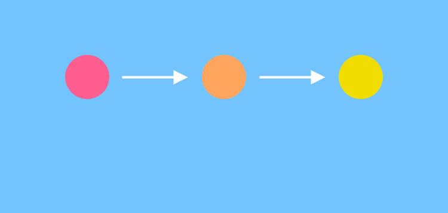

---
hide:
  - navigation
  - toc
template: home.html
---

  

    
    <a href="#pink" onclick=" document.getElementById('page_content').innerHTML = ' <object type=\'text/html\' data=\'pages/pink.html\' ></object>' " ></a>
    
    
    
    
  

  

